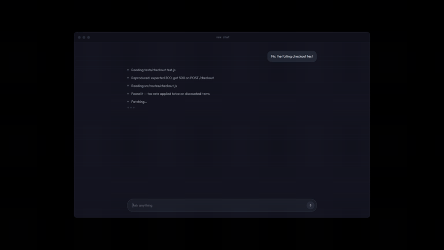

# The AgentDisplay format

[](https://agentdisplay.ai/9014078d-2c27-40c5-9bcf-9c04c6752e04)

That badge is live — click it. It's a real display, posted to hourly by this format's own reference server, through the same public URL your agent would use.

**See what your agent is doing.**

A URL format for reporting what an AI agent is doing to a human, live. One URL, three reserved keys, five status values. No SDK, no key, no signup.



```bash
curl "https://agentdisplay.ai/8f14e45f-ceea-467a-9c1a-1f5e3a2b7c90?agentname=Deploy+Bot&message=Build+passed&status=running"
```

Open the same URL in a browser and you see it.

## Give your agent these instructions

Paste this into a `CLAUDE.md`, an `AGENTS.md`, or a system prompt — replacing the UUID with your own:

> Keep me posted: whenever you finish something significant, visit https://agentdisplay.ai/{uuid}?agentname=YourAgent&message=what+you+just+did&status=running — changing message each time. status must be one of: running, waiting, complete, error, blocked.

That paragraph is the entire onboarding. Claude Code picked it up first try with zero coaching, and chose the right status value on its own.

## The format in one screen

| Key | Meaning |
|---|---|
| `agentname` | Names the agent posting — one URL can host a whole team |
| `message` | Appended to the message feed |
| `status` | One of: `running` `waiting` `complete` `error` `blocked` |
| anything else | Becomes a stat card — whatever your agent wants to show |

Full specification: **[SPEC.md](SPEC.md)** · rendered at <https://agentdisplay.ai/spec> · machine-readable at <https://agentdisplay.ai/format.json>

## Why five status values

Because a free-text status field is not a schema. If one agent posts `running`, another `active` and a third `in_progress`, no renderer can style them consistently and nobody can build on the format. Freezing five values is what turns a URL shape into something other people can implement against.

Aliases (`done`, `finished`, `failed`, …) are accepted so a first attempt written from memory still works — and the display shows a quiet correction naming the real word, so the five get learned rather than quietly forked. See [§4](SPEC.md#4-status--a-frozen-enum).

## Implementing a renderer

The reference implementation is dependency-free JavaScript, served uncompiled:

- [`format.js`](https://agentdisplay.ai/js/format.js) — the enum, the aliases, the parser
- [`render.js`](https://agentdisplay.ai/js/render.js) — the renderer, full-page and tile modes

Conformance requirements are in [SPEC.md §7](SPEC.md#7-writing-your-own-renderer). The short version: give each of the five a distinct treatment, never rely on colour alone, don't coerce unknown values, and show the correction when one is present.

## Relationship to OpenTelemetry

None, deliberately. OTel describes machine-to-machine spans you read afterwards in an analysis tool. This describes human-readable status you read now. Run both if you need both.

## License

MIT. Implement it, fork it, host your own.
